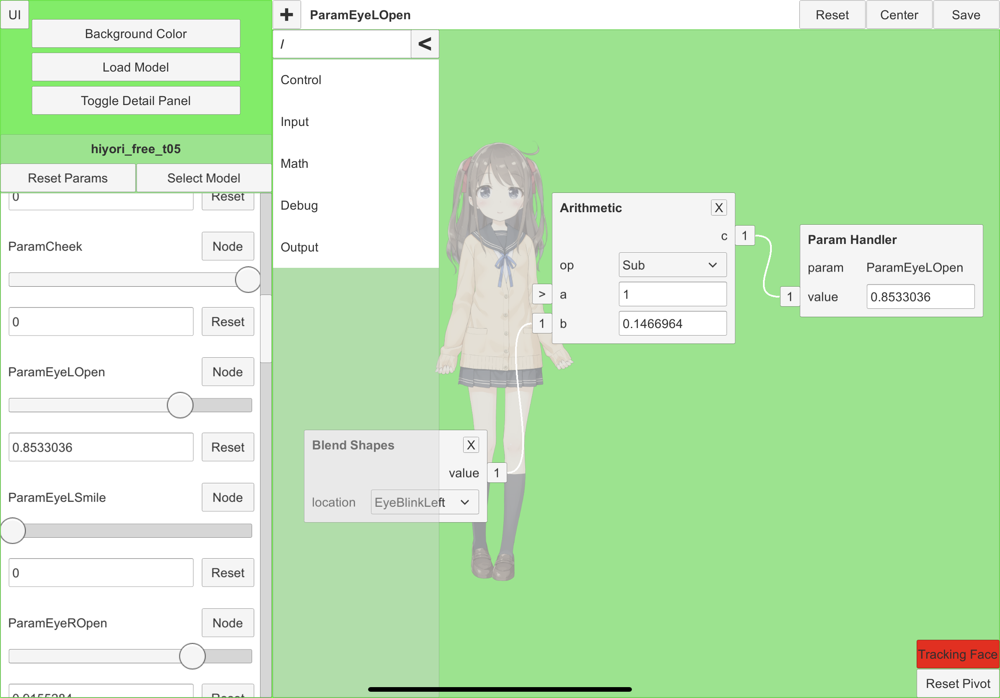

# XLand

Live2D VTuber App，用节点图绑定动作。节点图另行储存，可以把绑定信息直接应用到其他模型上。



> Q：为什么背景是难看的绿色
>
> A：绿幕，方便在OBS里自动过滤背景。如果不接OBS，只是想拿来玩，觉得颜色辣眼睛，可以点左上角的Background Color改变背景颜色
>
> Q：怎么把UI关掉
>
> A：点左上角正方形的UI键来取消或显示UI
>
> Q：怎么只显示左边边栏
>
> A：点左上角Toggle Detail Panel取消或显示右边一大片UI窗口

## 运行环境

+ iOS 12及以上
+ iPhone X，iPad Pro 2018年新款（11英寸，12.9英寸）

> Q：老版本不行么？
>
> A：不行，iOS面部捕捉需要ARKit 2.0
>
> Q：这些都太贵了，有没有便宜点的解决方案？
>
> A：可以用其他能够面部捕捉的外设，比如Kinect 2.0。自定义几个输入节点 ，让这个应用在电脑上直接运行。自定义节点很容易，详见后面的说明。
>
> Q：能用3D模型么？
>
> A：目前不行，没留接口，得改代码。

## 依赖

+ [JSON .NET For Unity](https://assetstore.unity.com/packages/tools/input-management/json-net-for-unity-11347)
+ [Live2D Cubism SDK R10](https://live2d.github.io/#unity)

## 使用方法

先编译，再运行

> Q：为啥不直接提供编译好的APP？
>
> A：想要分发iOS APP需要开发者账号，我又穷又懒，没有开发者账号
>
> Q：不能在电脑上运行么？
>
> A：无论在哪里运行，为了捕捉面部，必须有个外设。如果是用ARKit，必须有一个苹果设备，并且在设备上装个相应的APP，用户还是得经历相同的编译运行流程。我正考虑集成[facial-ar-remote](https://github.com/Unity-Technologies/facial-ar-remote)，这样iOS设备就是个单纯的采集器，之后添加Kinect支持时会更自然。

## 编译

先确保电脑上装着下面这些东西

+ macOS Mojave及以上
+ Xcode 10.0+
+ Unity 2017.4.8f1

> Q：那我岂不是还得有个Mac？
>
> A：是的，要玩苹果的设备是这样的
>
> Q：有没有便宜点的方法？
>
> A：说不定有呢（

编译的具体步骤

1. 下载项目，用Unity打开
2. 从Unity Asset Store中导入[JSON .NET For Unity](https://assetstore.unity.com/packages/tools/input-management/json-net-for-unity-11347)
3. 从官网下载[Live2D Cubism SDK R10](https://live2d.github.io/#unity)，双击下载得到的unitypackage，导入
4. **注意各个部分的LICENSE**
5. 设置Build target为iOS（Unity要事先装好iOS编译模块），把XLand/XLand添加到Scenes In Build，点Build编译，得到相应的Xcode project.
6. 双击.xcodeproj，点左侧边栏最上方的项目目录，设置General > Signing的Team为你自己的Team，在左上角设置目标设备为你的iOS设备（记得事先连电脑），最后点播放键运行
7. 步骤6编译出的是带有一定性能损失的ReleaseForRunning版本。如果觉得太卡的话，Xcode按快捷键`CMD + <`，把Build Configuration改成Release，取消Debug executable前面的勾选，然后重新按播放键运行
8. 日常使用的话，不用每次都编译，因为在按完播放键以后，这个APP已经被安装到你的iOS设备上了，可以像用普通的APP一样用它。如果编译时选择的Team不是开发者账号的话，过个几天APP的签名会过期，会出现打开闪退的情况。那时候只需要接上设备，打开xcodeproj，再按一下播放键重新编译就行。

## 模型导入

1. 首先，要有一个Live2D模型，这方面请拜托你的美工朋友。如果只是试用，可以用Live2D官网提供的[样例模型](https://docs.live2d.com/cubism-editor-manual/sample-model/)，在用的时候请**注意LICENSE**，虽然桃瀬ひより（这个文件开头的示例模型）很可爱，但请不要直接用她进行VTuber活动
2. Live2D模型文件（.cmo3）不能直接被导入，需要利用Cubism编辑器导出成正确的格式（.moc3，配上一个.model.json）。如果格式正确，可以直接看步骤6
3. 打开[Cubism编辑器](http://cubism3.live2d.com.s3-website-ap-northeast-1.amazonaws.com/download_en.html)，安装完成之后，打开Live2D Cubism Editor
4. 点ファイル > ファイルを開く，选中模型的.cmo3文件，点開く，从而打开模型（不懂日文的同学请肉眼匹配文字形状
5. 点ファイル > 組込み用ファイル書き出し > moc3ファイル書き出し，有必要的话稍作设置，点OK导出（导出目标最好是个空文件夹
6. iPad连电脑，打开iTunes，文件共享，选中XLand，把导出得到的那写文件直接拖进去
7. 打开XLand，点Load Model，点.model3.json（橘黄色加粗项）导入模型

> Q：怎么这么麻烦
>
> A：Cubism SDK就是这么用的，没法简化。不过这个步骤只需要做一次，不用重复劳动（

## 节点编辑器

### 现有节点功能说明

+ Input/ARKit：有关旋转的输出都是欧拉角，位置和旋转用的都是和Unity一致的左手系；Blend Shapes下面有很多选项，这些选项和ARKit文档中是一致的，想要查看文档，打开Xcode，点Help > Developer Documentation，在搜索框中搜索ARFaceAnchor.BlendShapeLocation

+ Math下面的节点功能基本上与Unity提供的Mathf中的同名函数相同
+ Math/Activation里是一些神经网络常用的激活函数。闲得无聊时候，可以用节点编辑器搭神经网络，然后手动把训练好的权重一个个输进去。因为没有反向传播这一过程，所以没法用来训练。这样显然很麻烦，不如写一个自定义节点把神经网络接进去，这样世界上就有了真正的AI VTuber（大雾
+ Debug里Node Local Position 用来让你知道自己在画布的哪个位置，找不到图的时候可以用这个找位置，或者点右上角的Reset恢复画布的缩放和位置，右上角的Center只恢复画布的位置
+ Control/Pivot节点用来设定中心值。这在使用脸和眼球位置时很有用，因为用户往往不知道坐标原点在哪里，也不知道世界坐标系的朝向。事实上，只要知道相对于静止位置的偏移量就够了，Pivot用来设置某个值的原点。Pivot可以是静态（Static）的或者动态（Dynamic）的。按右下角的Reset Pivot按钮时，所有的Dynamic Pivot都会把当前的输入值作为校准点，Static Pivot则不会受到影响。

### 扩展

节点编辑器的功能是高度可定制的，看下面的代码

```c#
[MarkAsNode(DisplayName = "Math/Activation/LeakyReLU")]
public class LeakyReLU : Node
{
    [MarkAsNodeField(Type = NodeFieldType.Input)]
    public float input;

    [MarkAsNodeField(Type = NodeFieldType.Input)]
    public float slop;

    [MarkAsNodeField(Type = NodeFieldType.Output)]
    public float output;

    public override void Evaluate()
    {
        output = input > 0 ? input : input * slop;
    }
}
```

稍有经验的C#程序员应该已经知道该怎么做了，下面是一些说明

所有继承了XLand.Node的类都是节点，可以在节点编辑器里使用。为了通过编译，用户需要实现虚方法Evaluate。除此之外，不需要任何其他代码

```c#
// 这已经是一个自定义节点了，会在节点编辑器中显示
class MyCustomNode : Node
{
    public override void Evaluate() 
    {
        // do calculation
    }
}
```

只有被MarkAsNodeField的field才会在编辑器中显示，并且在节点文件中储存，目前只能标记field（不能标记property），field的类型只能是float，string，或者enum

## 节点图文件

节点图文件必须和模型同名，放在同一个文件夹下，并且后缀名是.xlander.json

比如：模型hiyori_free_t05.model3.json对应的节点图文件为hiyori_free_t05.xlander.json

> Q：为什么这么麻烦
>
> A：本来可以选择手动选择模型和绑定文件，就跟那些MMD之类的软件手动加载模型之后得手动加载动作文件一样。可我觉得每次打开模型要手动加载两样东西好累啊（躺）。共享节点图应该是个比较少见的操作，一般一个VTuber只会有一个模型，不会频繁地共享节点图文件。限制文件的命名之后，保存之类的操作也只需要按一下Save键就行了，简陋但简化（懒还找借口）
>
> Q：已经绑好的节点图文件么（躺）
>
> A：勤奋的同学可以绑完之后给我Pull requests（躺）

## 已知的BUG

1. 双指缩放节点编辑界面时候画面会鬼畜，暂时请温柔地缩放

## FAQ

> Q：我不会编译
>
> A：可以问问你的程序员朋友
>
> Q：闪退怎么办？
>
> A：目前项目处在测试阶段，可能会出现各种bug，编辑节点时记得点右上角的Save按钮保存。遇到重大BUG欢迎在github上发issue
>
> Q：用这项目要钱么
>
> A：反正不用给我打钱，我的代码不用钱。但Cubism SDK很麻烦。根据使用的方式，你可能要和Live2D的LICENSE斗智斗勇，具体的约束条件请参阅Cubism SDK的[LICENSE](https://live2d.github.io/#unity)，看不懂的话请根据自身情况骚扰Live2D客服。
>
> Q：我需要自称XLander么
>
> A：不用。当然，如果你能这样自称的话我是很高兴的。
>
> Q：说起来你为啥要写这个项目？
>
> A：我单推湊あくあ，有点gachi的那种。但我没时间，没才华，没能力亲自成为VTuber，更加没办法发展到能跟她联动，只能写写代码，发发牢骚这样子。要是这个项目能给其他想要成为VTuber的朋友提供一些帮助就好了。
>
> Q：我喜欢这个项目，开发者真可爱，我想给开发者打钱
>
> A：暂时没开放打钱方式（